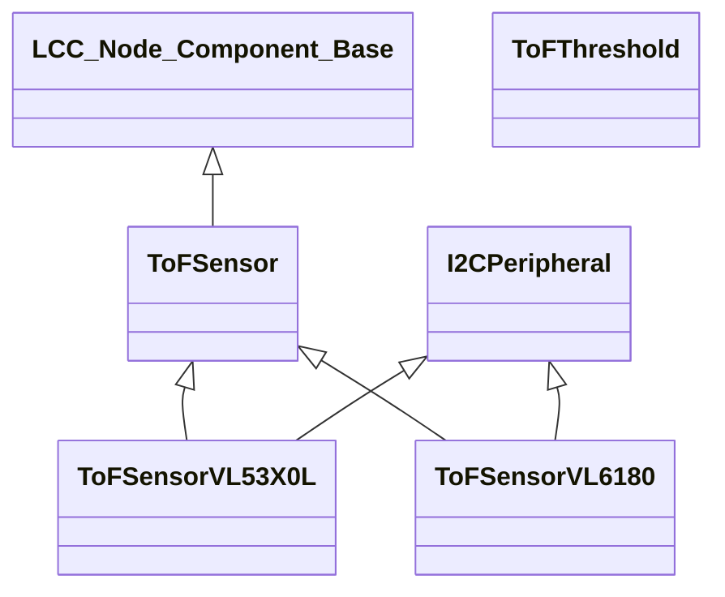

# LCC_TOF_SENSOR
This component is part of a suite of components which can be used as part of a program which implements an OpenLCB/LCC node. It has been developed using PlatformIO and has been tested on an Arduino Nano ESP32. The program which includes this component will drive an I2C multiplexor and the multiplexor's output ports will be connected to one or more ToF sensors. Two types of sensor can be connected - VL6180 and VL53X0L.

This component implements the following classes;-
- ```ToFThreshold```. This class represents a threshold which is associated with a sensor.
- ```ToFSensor```. This class represents a sensor which can be connected to one of the I2C multiplexor ports.
- ```ToFSensorVL6180```. This class includes the functionality which is specific to the VL6180 sensor.
- ```ToFSensorVL53X0L```. This class includes the functionality which is specific to the VL53L0X sensor.

This component has the following dependencies;-
- [LCC_NODE_COMPONENT_BASE](https://github.com/JohnCallingham/LCC_NODE_COMPONENT_BASE.git)
- [I2C_PERIPHERAL](https://github.com/JohnCallingham/I2C_PERIPHERAL.git)
- [Adafruit_VL6180X](https://github.com/adafruit/Adafruit_VL6180X.git)
- [Adafruit_VL53L0X](https://github.com/adafruit/Adafruit_VL53L0X.git)

The following software components are dependencies of one or more of the above components;-
- [Adafruit BusIO](https://github.com/adafruit/Adafruit_BusIO)
- [Adafruit GFX Library](https://github.com/adafruit/Adafruit-GFX-Library)
- [Adafruit SSD1306](https://github.com/adafruit/Adafruit_SSD1306)

The PlatformIO Library Dependency Finder handles downloading all dependencies.

## Functions

The following functionality is implemented for each ToF sensor;-
- Events are sent when the sensor detects an object closer than the near threshold or further away than the far threshold.
- Allows near and far thresholds to be set by providing the target threshold and a hysterisis value. Half of the hysterisis value is subtracted from the target threshold to determine the near threshold. Half of the hysterisis value is added to the target threshold to determine the far threshold. 
- Allows for initial events to be sent to keep JMRI up to date.
- Responds to queries from JMRI for the current state of each event.

## Class hierarchy



