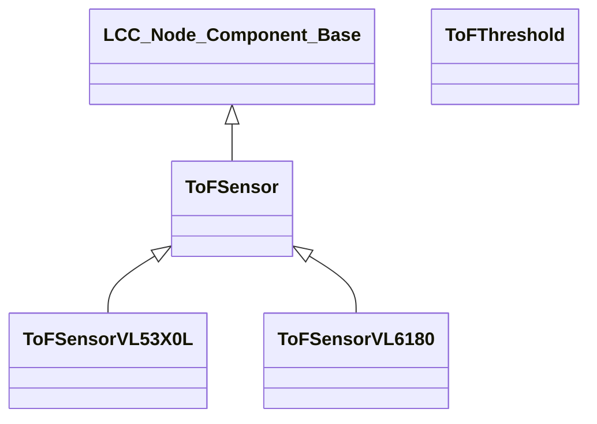

# LCC_TOF_SENSOR
This component is part of a suite of components which can be used as part of a program which implements an OpenLCB/LCC node. It has been developed using PlatformIO and has been tested on an Arduino Nano ESP32. The program which includes this component will drive an I2C multiplexor and the multiplexor's output ports will be connected to one or more VL6180X ToF sensors.

This component implements two classes;-
- ```ToFSensor```. This class represents a sensor which can be connected to one of the I2C multiplexor ports.
- ```ToFThreshold```. This class represents a threshold which is associated with a sensor.

This component has the following dependencies;-
- LCC_NODE_COMPONENT_BASE: https://github.com/JohnCallingham/LCC_NODE_COMPONENT_BASE.git
- Adafruit_VL6180X: https://github.com/adafruit/Adafruit_VL6180X.git

The following software components are dependencies of one or more of the above components;-
- Adafruit BusIO: https://github.com/adafruit/Adafruit_BusIO
- Adafruit GFX Library: https://github.com/adafruit/Adafruit-GFX-Library
- Adafruit SSD1306: https://github.com/adafruit/Adafruit_SSD1306


The PlatformIO Library Dependency Finder handles downloading all dependencies.

## Functions

The following functionality is implemented for each ToF sensor;-

## Class hierarchy



